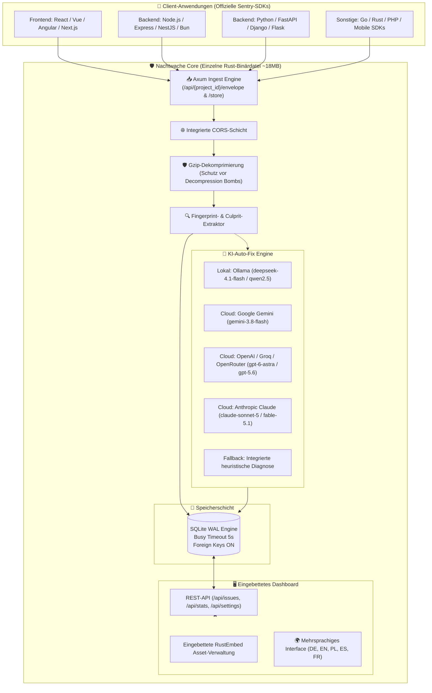

# 🛡️ Nachtwache

<p align="center">
  🌐 <strong>Sprachen / Languages:</strong>
  <a href="README.md">🇬🇧 English</a> •
  <a href="README.pl.md">🇵🇱 Polski</a> •
  <a href="README.de.md"><strong>🇩🇪 Deutsch</strong></a> •
  <a href="README.es.md">🇪🇸 Español</a> •
  <a href="README.fr.md">🇫🇷 Français</a>
</p>

<p align="center">
  <strong>Ultra-leichtgewichtiges, autonomes Error-Tracking & 100% wartungsfreier Drop-In-Ersatz für Sentry mit KI-Auto-Fix.</strong><br>
  <em>Einzelne Rust-Binärdatei, integriertes Web-Dashboard, transaktionales SQLite (WAL) und weniger als 15 MB RAM-Verbrauch.</em>
</p>

<p align="center">
  <a href="https://sentry.social-wulf.eu"></a>
  <a href="LICENSE"></a>
  
  
  
  <a href="https://buymeacoffee.com/adrianwulf"></a>
  <a href="https://github.com/sponsors/adrian-wulf"></a>
</p>

<p align="center">
  
  
  
  
  
  
</p>

---

## 📑 Inhaltsverzeichnis
1. [⚡ Warum Nachtwache?](#-warum-nachtwache)
2. [🌐 Das Adrian Wulf Ökosystem](#-das-adrian-wulf-ökosystem)
3. [📊 Vergleich: Offizielles Sentry vs. Nachtwache](#-vergleich-offizielles-sentry-vs-nachtwache)
4. [🏗️ Systemarchitektur](#️-systemarchitektur)
5. [🚀 Schnellstart](#-schnellstart)
6. [🔌 SDK-Anbindung (Drop-In Sentry)](#-sdk-anbindung-drop-in-sentry)
7. [🤖 KI-Konfiguration (Auto-Fix & Git-Patch)](#-ki-konfiguration-auto-fix--git-patch)
8. [🌐 Produktiver Betrieb (Coolify & Docker)](#-produktiver-betrieb-coolify--docker)
9. [☕ Projekt unterstützen (Buy Me a Coffee & GitHub Sponsors) & RobinHood dev](#-projekt-unterstützen-buy-me-a-coffee--github-sponsors--robinhood-dev)
10. [⚖️ Impressum & Rechtliche Hinweise (§ 5 DDG / MIT)](#️-impressum--rechtliche-hinweise--5-ddg--mit)

---

## ⚡ Warum Nachtwache?

Das offizielle Sentry ist ein anerkannter Industriestandard. Für Freiberufler, Startups und kleine bis mittlere Entwicklerteams wirft es jedoch erhebliche Hürden auf:
1. **SaaS ist teuer mit rigiden Kontingenten**: Das kostenlose Kontingent von 5.000 Events verpufft im Ernstfall binnen Minuten bei einer einzigen Produktions-Fehlerschleife. Bezahlte Pläne steigen drastisch im Preis.
2. **Self-Hosted ist ein gigantischer Infrastruktur-Moloch**: Der offizielle Docker-Compose-Stack startet **über 20 Microservices** (Kafka, ClickHouse, PostgreSQL, Redis, Snuba, Celery, Relay, Zookeeper) und benötigt mindestens **16 bis 32 GB RAM**. Das bedeutet hunderte Euro Serverkosten pro Monat nur für Fehlermonitoring!
3. **Lizenz-Fallen (BSL/FSL)**: Restriktive Lizenzen schränken die kommerzielle Unabhängigkeit ein.

**Nachtwache löst dieses Dilemma ein für alle Mal:**
* **Keine externen Abhängigkeiten**: Eine einzelne, eigenständige Rust-Binärdatei bündelt den asynchronen HTTP-Server, eine eingebettete SQLite-Datenbank im WAL-Modus und das vollständige Web-UI.
* **100% Drop-In-Kompatibilität zu Sentry-SDKs**: Funktioniert nahtlos mit `@sentry/browser`, `@sentry/node`, `sentry-sdk` (Python), Go, Rust, PHP und Mobile-SDKs. Es genügt, die DSN-Adresse auszutauschen.
* **KI-Auto-Fix & Git-Patch auf Knopfdruck**: Analysiert Fehlerursachen via LLM (lokales Ollama, Gemini, OpenAI, Claude) und generiert direkt anwendbare Unified-Git-Diffs.
* **Minimaler Ressourcenverbrauch**: Verbraucht lediglich **ca. 15 MB RAM** und 0% CPU im Leerlauf. Läuft stabil auf einem 4-Euro-VPS, einem Raspberry Pi oder in der Oracle Free Tier.
* **Datenschutz & DSGVO / GDPR-Konformität**: Sämtliche Telemetriedaten verbleiben auf Ihrem eigenen Server – ohne Übertragung an US-Cloudanbieter.

---

## 🌐 Das Adrian Wulf Ökosystem

Nachtwache ist Teil einer unabhängigen Suite moderner Entwickler- und Business-Werkzeuge unter der **RobinHood dev** Philosophie:

| Dienst / Projekt | Live-URL | Zweck |
| :--- | :---: | :--- |
| 🛡️ **Nachtwache (Cloud)** | [sentry.social-wulf.eu](https://sentry.social-wulf.eu) | **Live-Instanz:** Absturz-Monitoring, Sentry Drop-In Alternative & KI-Auto-Fix (~15 MB RAM). |
| 🚀 **Wulf Lead.er** | [lead.social-wulf.eu](https://lead.social-wulf.eu) | **B2B Lead Intelligence & OSINT Auditor:** Lokale B2B-Akquise, SEO/Core Web Vitals Prüfung, Tech-Stack-Erkennung & KI-Pitch-Generierung. |
| 🌐 **Zentraler Wulf Hub** | [social-wulf.eu](https://social-wulf.eu) | **Zentrales Hub:** Portfolio, Business-Tools & technische Dokumentationsplattform von Adrian Wulf. |
| 💼 **Wulf Code** | [wulf-code.it](https://wulf-code.it) | **Softwarehaus & Consulting:** Individuelle Softwareentwicklung, Hochleistungssysteme und Sicherheitsaudits. |

---

## 📊 Vergleich: Offizielles Sentry vs. Nachtwache

| Merkmal / Kriterium | Offizielles Sentry (Self-Hosted) | Sentry Cloud (SaaS) | 🛡️ **Nachtwache** (Adrian Wulf) |
| :--- | :---: | :---: | :---: |
| **RAM-Bedarf** | **16 GB – 32 GB RAM** | Entfällt (Cloud) | **~15 MB RAM** |
| **Container-Anzahl** | **20+ Microservices** (Kafka, ClickHouse, Postgres, Redis...) | Geschlossene Cloud | **1 einzelne Binärdatei** oder 1 schlanker Container |
| **Serveranforderungen** | Dedizierter Server (min. 4–8 vCPUs) | Keine (nur Client) | 4€ VPS / Raspberry Pi / Free Tier |
| **Sentry SDK Protokoll** | 100% nativ | 100% nativ | **100% Drop-In-Kompatibilität** |
| **Datenbank** | PostgreSQL + ClickHouse + Redis | Entfällt | **Integriertes SQLite (WAL) mit Auto-Vacuum** |
| **KI-Auto-Fix & Git-Patch** | Nicht enthalten | Teures Enterprise-Add-on | **Standardmäßig integriert** (Ollama, Gemini, OpenAI, Claude) |
| **Einrichtungsdauer** | 30–60 Minuten | Cloud-Konto | **1 Minute** (`cargo run` oder `docker compose up`) |
| **Coolify-Unterstützung** | Komplex / Nicht empfohlen | Entfällt (SaaS) | **Natives 1-Klick-Deployment** mit persistentem Volume |
| **DSGVO / Datenschutz** | Self-Hosted, hoher Ops-Aufwand | Daten bei US-Drittanbietern | **100% On-Premise**, kein Tracking |
| **Lizenz & Kosten** | FSL / BSL (kommerzielle Hürden) | 26 $ bis 500 $+ / Monat | **100% freie MIT-Lizenz** |

---

## 🏗️ Systemarchitektur

Nachtwache folgt den Leitprinzipien von Minimalismus, Geschwindigkeit und robuster Zuverlässigkeit:



---

## 🚀 Schnellstart

### Option 1: Docker Compose (Empfohlen)

Repository klonen und Container starten:

```bash
git clone https://github.com/adrian-wulf/nachtwache.git
cd nachtwache
docker compose up -d
```

Im Browser aufrufen:
* Dashboard UI: `http://localhost:8080`
* Ingestion DSN: `http://public@localhost:8080/1`

### Option 2: Nativ via Cargo ausführen

Voraussetzung: Rust 1.85+ installiert:

```bash
git clone https://github.com/adrian-wulf/nachtwache.git
cd nachtwache
cargo run --release
```

---

## 🔌 SDK-Anbindung (Drop-In Sentry)

Nachtwache benötigt keinen proprietären SDK-Code. Verwenden Sie einfach die offiziellen Sentry-Bibliotheken und tragen Sie Ihre Nachtwache-DSN ein.

### 1. JavaScript / TypeScript (React, Vue, Next.js, Browser)
```typescript
import * as Sentry from "@sentry/browser";

Sentry.init({
  dsn: "http://public@localhost:8080/1", // oder https://sentry.ihre-domain.de/1
  tracesSampleRate: 1.0,
});
```

### 2. Node.js / Express / NestJS
```typescript
import * as Sentry from "@sentry/node";

Sentry.init({
  dsn: "http://public@localhost:8080/1",
});
```

### 3. Python (FastAPI, Django, Flask)
```python
import sentry_sdk

sentry_sdk.init(
    dsn="http://public@localhost:8080/1",
    traces_sample_rate=1.0,
)
```

---

## 🤖 KI-Konfiguration (Auto-Fix & Git-Patch)

Im Reiter **KI-Konfiguration** des Dashboards können Sie Ihren bevorzugten LLM-Anbieter aktivieren:

1. **Ollama (Standard & 100% lokal / kostenlos)**:
   * Endpoint: `http://localhost:11434` (bzw. `http://host.docker.internal:11434` innerhalb von Docker)
   * Empfohlenes Modell: `deepseek-4.1-flash` oder `deepseek-v3`
2. **Google Gemini**:
   * Modell: `gemini-3.8-flash`
   * API-Schlüssel: Erhältlich via [Google AI Studio](https://aistudio.google.com/)
3. **OpenAI / Groq / DeepSeek / OpenRouter**:
   * Endpoint: `https://api.openai.com` (oder kompatibler Endpunkt)
   * Modell: `gpt-6-astra`, `gpt-5.6-sol` oder `deepseek-chat`
4. **Anthropic Claude**:
   * Modell: `claude-sonnet-5` oder `claude-fable-5-1`

---

## 🌐 Produktiver Betrieb (Coolify & Docker)

Installation in Coolify innerhalb von Sekunden:
1. Neuen Dienst aus dem Git-Repository erstellen: `https://github.com/adrian-wulf/nachtwache.git`.
2. Port festlegen: `8080`.
3. Persistenter Speicher: Mounten Sie `/data`, um die SQLite-Datenbank dauerhaft zu sichern.

### Reverse-Proxy Konfiguration (Caddy mit automatischem HTTPS)
```caddy
sentry.ihre-domain.de {
    reverse_proxy 127.0.0.1:8080
}
```

---

## ☕ Projekt unterstützen (Buy Me a Coffee & GitHub Sponsors) & RobinHood dev

<p align="center">
  <a href="https://buymeacoffee.com/adrianwulf"></a>
  <a href="https://github.com/sponsors/adrian-wulf"></a>
</p>

### Was bedeutet die RobinHood dev Philosophie?
> **"Moderne Entwicklerwerkzeuge, Ausfallsicherheit und performante Infrastruktur dürfen kein Privileg sein, das Großkonzernen mit riesigen Cloud-Budgets vorbehalten bleibt."**

Kommerzielle Monitoring-Dienste fesseln Entwickler häufig an unberechenbare Kostenmodelle:
* Hohe Rechnungen exakt dann, wenn ein Produktionsausfall zu dramatischen Fehlerwellen führt.
* Aufwendige Microservice-Cluster, die einen Vollzeit-DevOps-Betreuer erfordern.

**Nachtwache entstand im Geist von RobinHood dev:**
* Gibt Entwicklern, Freelancern und Startups eine autonome, ressourcenschonende Fehlerüberwachung und Code-Diagnose für 0 € an die Hand.
* 100% Open Source, ohne versteckte Telemetrie, Paywalls oder künstliche Funktionsbeschränkungen.

### Wie können Sie das Projekt unterstützen?
* ☕ **Buy Me a Coffee:** [buymeacoffee.com/adrianwulf](https://buymeacoffee.com/adrianwulf)
* 💖 **Unterstützung via GitHub Sponsors:** [github.com/sponsors/adrian-wulf](https://github.com/sponsors/adrian-wulf)
* ⭐ **Projekt auf GitHub mit einem Stern markieren:** Hilft Entwicklern weltweit, Nachtwache zu entdecken.
* 🛠️ **Pull Requests & Issues einreichen:** Bringen Sie eigene Ideen und Verbesserungen ein.

---

## ⚖️ Impressum & Rechtliche Hinweise (§ 5 DDG / MIT)

### Angaben gemäß § 5 deutsches Digitale-Dienste-Gesetz (DDG):
* **Entwickler / Herausgeber:** Adrian Wulf
* **Kontakt:** Erreichbar über GitHub: [https://github.com/adrian-wulf](https://github.com/adrian-wulf) sowie die Portale [https://social-wulf.eu](https://social-wulf.eu) / [https://wulf-code.it](https://wulf-code.it).

### Haftungsausschluss & MIT-Lizenz:
Die Software wird ohne jegliche ausdrückliche oder stillschweigende Gewährleistung bereitgestellt. Einzelheiten entnehmen Sie bitte der Lizenzdatei [LICENSE](LICENSE).

### Markenrechtlicher Hinweis:
**Sentry** und das Sentry-Logo sind eingetragene Marken der **Functional Software, Inc.**  
**Nachtwache** ist ein eigenständiges Open-Source-Projekt, welches das offene Protokoll zur Fehlererfassung implementiert. Es besteht keinerlei geschäftliche Verbindung, Autorisierung oder Sponsoring durch Functional Software, Inc.

---

<p align="center">
  <em>Mit Leidenschaft für die Open-Source-Community entwickelt von Adrian Wulf.</em>
</p>
