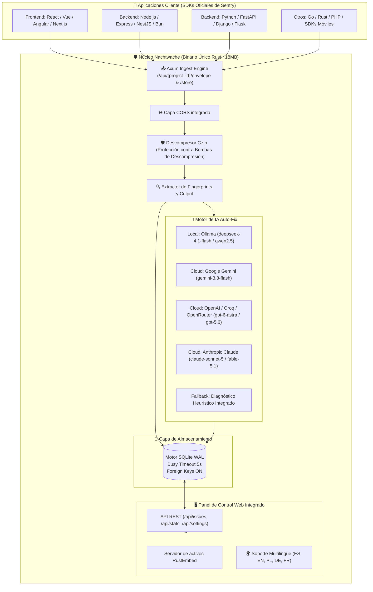

# 🛡️ Nachtwache

<p align="center">
  🌐 <strong>Idiomas / Languages:</strong>
  <a href="README.md">🇬🇧 English</a> •
  <a href="README.pl.md">🇵🇱 Polski</a> •
  <a href="README.de.md">🇩🇪 Deutsch</a> •
  <a href="README.es.md"><strong>🇪🇸 Español</strong></a> •
  <a href="README.fr.md">🇫🇷 Français</a>
</p>

<p align="center">
  <strong>Monitor de errores ultraligero y autónomo, sustituto directo 100% libre de mantenimiento para Sentry con Auto-Fix mediante IA.</strong><br>
  <em>Binario único en Rust, panel de control Web UI integrado, SQLite transaccional (WAL) y menos de 15 MB de memoria RAM.</em>
</p>

<p align="center">
  <a href="https://sentry.social-wulf.eu"></a>
  <a href="LICENSE"></a>
  
  
  
  <a href="https://buymeacoffee.com/adrianwulf"></a>
  <a href="https://github.com/sponsors/adrian-wulf"></a>
</p>

<p align="center">
  
  
  
  
  
  
</p>

---

## 📑 Tabla de Contenidos
1. [⚡ ¿Por qué Nachtwache?](#-por-qué-nachtwache)
2. [🌐 El Ecosistema de Adrian Wulf](#-el-ecosistema-de-adrian-wulf)
3. [📊 Comparativa: Sentry Oficial vs Nachtwache](#-comparativa-sentry-oficial-vs-nachtwache)
4. [🏗️ Arquitectura del Sistema](#️-arquitectura-del-sistema)
5. [🚀 Inicio Rápido](#-inicio-rápido)
6. [🔌 Conexión de SDKs (Sustituto de Sentry)](#-conexión-de-sdks-sustituto-de-sentry)
7. [🤖 Configuración de IA (Auto-Fix y Parche Git)](#-configuración-de-ia-auto-fix-y-parche-git)
8. [🌐 Despliegue en Producción (Coolify y Docker)](#-despliegue-en-producción-coolify-y-docker)
9. [☕ Apoya el Proyecto (Buy Me a Coffee & GitHub Sponsors) y RobinHood dev](#-apoya-el-proyecto-buy-me-a-coffee--github-sponsors-y-robinhood-dev)
10. [⚖️ Aviso Legal e Impressum (§ 5 DDG / MIT)](#️-aviso-legal-e-impressum--5-ddg--mit)

---

## ⚡ ¿Por qué Nachtwache?

El Sentry oficial es un estándar indiscutible de la industria, pero para desarrolladores independientes, pequeñas y medianas empresas o proyectos ágiles presenta dos grandes barreras:
1. **SaaS costoso con cuotas restrictivas**: El plan gratuito de 5.000 eventos puede agotarse en minutos durante un único bucle de error en producción. Los planes de pago escalan velozmente.
2. **El Self-Hosted es un monstruo de infraestructura**: La pila oficial de Docker Compose levanta **más de 20 microservicios** (Kafka, ClickHouse, PostgreSQL, Redis, Snuba, Celery, Relay, Zookeeper) y exige un mínimo de **16 a 32 GB de RAM**. ¡Cientos de euros al mes solo para registrar errores!
3. **Restricciones de licencia (BSL/FSL)**: Licencias que limitan la libertad operativa y comercial.

**Nachtwache resuelve esto de raíz:**
* **Cero dependencias externas**: Un único binario compilado en Rust con motor HTTP asíncrono, base de datos SQLite integrada en modo WAL y panel Web UI completo.
* **100% Compatible con SDKs oficiales de Sentry**: Funciona de inmediato con `@sentry/browser`, `@sentry/node`, `sentry-sdk` (Python), Go, Rust, PHP y SDKs móviles. Solo necesitas cambiar el DSN en tu configuración.
* **Auto-Fix con Inteligencia Artificial y Parches Git**: Diagnostica las causas raíz con LLMs (Ollama local, Gemini, OpenAI, Claude) y genera parches de código Git listos para aplicar.
* **Consumo de recursos mínimo**: Utiliza **apenas ~15 MB de RAM** y 0% de CPU en reposo. Funciona sin esfuerzo en un VPS de 4€, una Raspberry Pi o la capa gratuita de Oracle Cloud.
* **Privacidad y Cumplimiento RGPD / GDPR**: Todos los datos se quedan en tu servidor, sin fugas hacia macroproveedores en EE. UU.

---

## 🌐 El Ecosistema de Adrian Wulf

Nachtwache forma parte de una suite independiente de herramientas para desarrolladores y negocios bajo la filosofía **RobinHood dev**:

| Servicio / Proyecto | URL en Vivo | Propósito |
| :--- | :---: | :--- |
| 🛡️ **Nachtwache (Cloud)** | [sentry.social-wulf.eu](https://sentry.social-wulf.eu) | **Instancia en producción:** Registro de fallos, alternativa directa a Sentry y Auto-Fix IA (~15 MB RAM). |
| 🚀 **Wulf Lead.er** | [lead.social-wulf.eu](https://lead.social-wulf.eu) | **B2B Lead Intelligence y Auditor OSINT:** Prospección B2B local, auditorías SEO/Core Web Vitals, detección de stack técnico y redacción de propuestas comerciales con IA. |
| 🌐 **Hub Central Wulf** | [social-wulf.eu](https://social-wulf.eu) | **Portal Central:** Portafolio, herramientas de negocio y documentación técnica por Adrian Wulf. |
| 💼 **Wulf Code** | [wulf-code.it](https://wulf-code.it) | **Software House y Consultoría:** Ingeniería de software a medida, sistemas de alto rendimiento y auditorías de seguridad. |

---

## 📊 Comparativa: Sentry Oficial vs Nachtwache

| Característica / Métrica | Sentry Oficial (Self-Hosted) | Sentry Cloud (SaaS) | 🛡️ **Nachtwache** (Adrian Wulf) |
| :--- | :---: | :---: | :---: |
| **Consumo de RAM** | **16 GB – 32 GB RAM** | N/A (Cloud) | **~15 MB RAM** |
| **Número de contenedores** | **20+ microservicios** (Kafka, ClickHouse, Postgres, Redis...) | Infraestructura cerrada | **1 binario único** o 1 contenedor ligero |
| **Requisitos de servidor** | Servidor dedicado (mínimo 4–8 vCPU) | Ninguno (solo cliente) | VPS de 4€ / Raspberry Pi / Free Tier |
| **Protocolo SDK de Sentry** | 100% nativo | 100% nativo | **100% Compatibilidad Directa** |
| **Base de Datos** | PostgreSQL + ClickHouse + Redis | N/A | **SQLite integrado (WAL) con auto-vacuum** |
| **Auto-Fix IA y Parche Git** | No incluido | Complemento Enterprise costoso | **Incluido de serie** (Ollama, Gemini, OpenAI, Claude) |
| **Tiempo de instalación** | 30–60 minutos | Registro en web | **1 minuto** (`cargo run` o `docker compose up`) |
| **Soporte para Coolify** | Complejo / No recomendado | N/A | **Despliegue en 1 clic** con volumen persistente |
| **Privacidad y RGPD** | Self-hosted pero complejo de operar | Datos cedidos a terceros | **100% On-Premise**, sin rastreadores |
| **Licencia y Coste** | FSL / BSL (restricciones comerciales) | De 26 $ a más de 500 $/mes | **100% Gratuito bajo Licencia MIT** |

---

## 🏗️ Arquitectura del Sistema

Nachtwache se diseñó bajo los pilares de minimalismo, velocidad de respuesta y resiliencia:



---

## 🚀 Inicio Rápido

### Opción 1: Docker Compose (Recomendado)

Clona el repositorio e inicia el contenedor:

```bash
git clone https://github.com/adrian-wulf/nachtwache.git
cd nachtwache
docker compose up -d
```

Abre en tu navegador:
* Panel Web: `http://localhost:8080`
* DSN de ingesta: `http://public@localhost:8080/1`

### Opción 2: Compilación Nativa con Cargo

Requisitos: Rust 1.85+ instalado:

```bash
git clone https://github.com/adrian-wulf/nachtwache.git
cd nachtwache
cargo run --release
```

---

## 🔌 Conexión de SDKs (Sustituto de Sentry)

Nachtwache no requiere librerías propietarias. Puedes utilizar cualquier SDK oficial de Sentry apuntando a tu DSN de Nachtwache.

### 1. JavaScript / TypeScript (React, Vue, Next.js, Browser)
```typescript
import * as Sentry from "@sentry/browser";

Sentry.init({
  dsn: "http://public@localhost:8080/1", // o https://sentry.tu-dominio.com/1
  tracesSampleRate: 1.0,
});
```

### 2. Node.js / Express / NestJS
```typescript
import * as Sentry from "@sentry/node";

Sentry.init({
  dsn: "http://public@localhost:8080/1",
});
```

### 3. Python (FastAPI, Django, Flask)
```python
import sentry_sdk

sentry_sdk.init(
    dsn="http://public@localhost:8080/1",
    traces_sample_rate=1.0,
)
```

---

## 🤖 Configuración de IA (Auto-Fix y Parche Git)

Desde la pestaña **Configuración IA** en el panel de control puedes configurar el proveedor LLM deseado:

1. **Ollama (Predeterminado, 100% local y gratuito)**:
   * Endpoint: `http://localhost:11434` (o `http://host.docker.internal:11434` dentro de Docker)
   * Modelos recomendados: `deepseek-4.1-flash` o `deepseek-v3`
2. **Google Gemini**:
   * Modelo: `gemini-3.8-flash`
   * Clave API: Disponible en [Google AI Studio](https://aistudio.google.com/)
3. **OpenAI / Groq / DeepSeek / OpenRouter**:
   * Endpoint: `https://api.openai.com` (o endpoint compatible)
   * Modelo: `gpt-6-astra`, `gpt-5.6-sol` o `deepseek-chat`
4. **Anthropic Claude**:
   * Modelo: `claude-sonnet-5` o `claude-fable-5-1`

---

## 🌐 Despliegue en Producción (Coolify y Docker)

Despliegue rápido en Coolify:
1. Añade un nuevo servicio a partir del repositorio Git: `https://github.com/adrian-wulf/nachtwache.git`.
2. Puerto del contenedor: `8080`.
3. Volumen Persistente: Monta la ruta `/data` para conservar la base de datos SQLite.

### Configuración Reverse Proxy (Caddy con HTTPS automático)
```caddy
sentry.tu-dominio.com {
    reverse_proxy 127.0.0.1:8080
}
```

---

## ☕ Apoya el Proyecto (Buy Me a Coffee & GitHub Sponsors) y RobinHood dev

<p align="center">
  <a href="https://buymeacoffee.com/adrianwulf"></a>
  <a href="https://github.com/sponsors/adrian-wulf"></a>
</p>

### ¿Qué es la filosofía RobinHood dev?
> **"Las herramientas de desarrollo avanzadas, la estabilidad operativa y la soberanía técnica no deben ser un privilegio exclusivo de corporaciones con presupuestos ilimitados."**

Las plataformas de monitorización actuales atan con frecuencia a los desarrolladores a suscripciones usureras:
* Elevando las facturas justo cuando una caída de producción genera picos masivos de errores.
* Obligando a desplegar enjambres de microservicios que requieren personal dedicado de DevOps.

**Nachtwache nació con el propósito de RobinHood dev:**
* Poner al alcance de cada desarrollador, freelancer o startup una monitorización de errores autónoma con diagnóstico de código a coste cero.
* 100% Código Abierto (Open Source), sin telemetría espía ni muros de pago.

### ¿Cómo puedes apoyar?
* ☕ **Buy Me a Coffee:** [buymeacoffee.com/adrianwulf](https://buymeacoffee.com/adrianwulf)
* 💖 **Patrocina en GitHub Sponsors:** [github.com/sponsors/adrian-wulf](https://github.com/sponsors/adrian-wulf)
* ⭐ **Dale una estrella al repositorio en GitHub:** Ayuda a que el proyecto llegue a más ingenieros en todo el mundo.
* 🛠️ **Envía Pull Requests e incidencias:** Comparte tus mejoras e ideas.

---

## ⚖️ Aviso Legal e Impressum (§ 5 DDG / MIT)

### Información conforme al § 5 de la Ley de Servicios Digitales alemana (DDG):
* **Desarrollador / Editor:** Adrian Wulf
* **Contacto:** Disponible mediante GitHub: [https://github.com/adrian-wulf](https://github.com/adrian-wulf) y a través de los portales [https://social-wulf.eu](https://social-wulf.eu) / [https://wulf-code.it](https://wulf-code.it).

### Exención de Responsabilidad y Licencia MIT:
El software se suministra "TAL CUAL", sin garantías de ningún tipo, expresas o implícitas. Consulta el archivo [LICENSE](LICENSE) para más información.

### Nota sobre Marcas Registradas:
**Sentry** y el logotipo de Sentry son marcas registradas de **Functional Software, Inc.**  
**Nachtwache** es un proyecto independiente de código abierto que implementa el protocolo abierto de recepción de eventos. No cuenta con afiliación, respaldo ni patrocinio por parte de Functional Software, Inc.

---

<p align="center">
  <em>Desarrollado con dedicación para la comunidad de código abierto por Adrian Wulf.</em>
</p>
