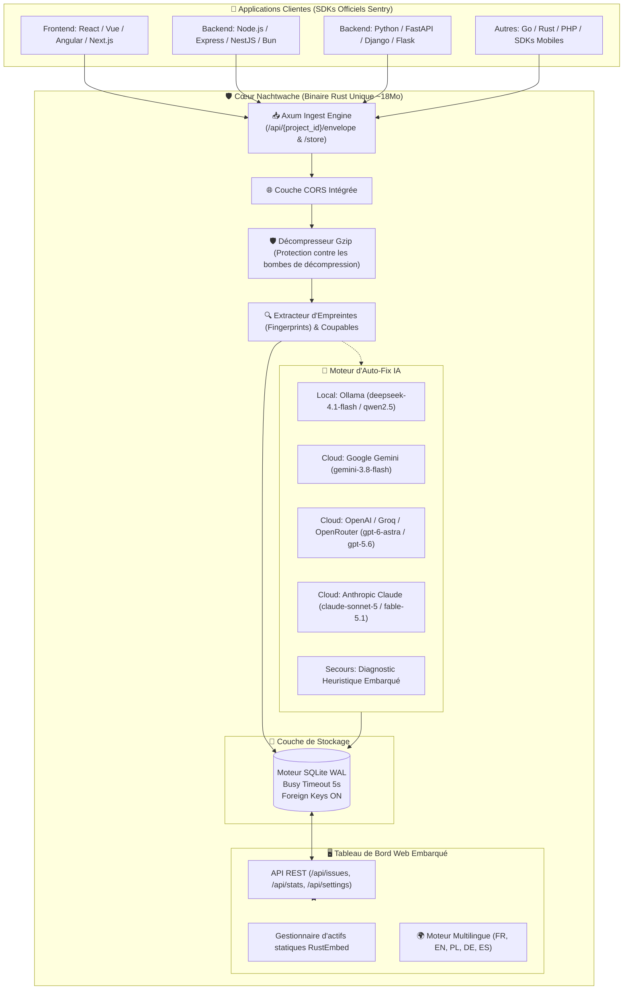

# 🛡️ Nachtwache

<p align="center">
  🌐 <strong>Langues / Languages:</strong>
  <a href="README.md">🇬🇧 English</a> •
  <a href="README.pl.md">🇵🇱 Polski</a> •
  <a href="README.de.md">🇩🇪 Deutsch</a> •
  <a href="README.es.md">🇪🇸 Español</a> •
  <a href="README.fr.md"><strong>🇫🇷 Français</strong></a>
</p>

<p align="center">
  <strong>Traqueur d'erreurs autonome ultra-léger et remplacement direct 100% sans maintenance pour Sentry avec Auto-Fix par IA.</strong><br>
  <em>Binaire Rust autonome unique, tableau de bord Web UI intégré, SQLite transactionnel (WAL) et empreinte mémoire sous 15 Mo de RAM.</em>
</p>

<p align="center">
  <a href="https://sentry.social-wulf.eu"></a>
  <a href="LICENSE"></a>
  
  
  
  <a href="https://buymeacoffee.com/adrianwulf"></a>
  <a href="https://github.com/sponsors/adrian-wulf"></a>
</p>

<p align="center">
  
  
  
  
  
  
</p>

---

## 📑 Table des Matières
1. [⚡ Pourquoi Nachtwache ?](#-pourquoi-nachtwache-)
2. [🌐 L'Écosystème Adrian Wulf](#-lécosystème-adrian-wulf)
3. [📊 Comparatif : Sentry Officiel vs Nachtwache](#-comparatif--sentry-officiel-vs-nachtwache)
4. [🏗️ Architecture Système](#️-architecture-système)
5. [🚀 Démarrage Rapide](#-démarrage-rapide)
6. [🔌 Connexion des SDKs (Alternative Directe à Sentry)](#-connexion-des-sdks-alternative-directe-à-sentry)
7. [🤖 Configuration de l'IA (Auto-Fix et Patch Git)](#-configuration-de-lia-auto-fix-et-patch-git)
8. [🌐 Déploiement en Production (Coolify et Docker)](#-déploiement-en-production-coolify-et-docker)
9. [☕ Soutenir le Projet (Buy Me a Coffee & GitHub Sponsors) & RobinHood dev](#-soutenir-le-projet-buy-me-a-coffee--github-sponsors--robinhood-dev)
10. [⚖️ Mentions Légales & Impressum (§ 5 DDG / MIT)](#️-mentions-légales--impressum--5-ddg--mit)

---

## ⚡ Pourquoi Nachtwache ?

Sentry officiel est un standard de l'industrie, mais pour les indépendants, les startups et les équipes de taille moyenne, il présente deux obstacles majeurs :
1. **Le SaaS est onéreux avec des quotas stricts** : Le quota gratuit de 5 000 événements peut s'évaporer en quelques minutes lors d'une boucle d'erreur en production. Les forfaits payants grimpent rapidement.
2. **L'auto-hébergement (Self-Hosted) est un gouffre d'infrastructure** : La pile Docker Compose officielle démarre **plus de 20 microservices** (Kafka, ClickHouse, PostgreSQL, Redis, Snuba, Celery, Relay, Zookeeper) et requiert au bas mot **16 à 32 Go de RAM**. Soit des centaines d'euros mensuels pour le seul suivi des bugs !
3. **Pièges de licences (BSL/FSL)** : Des restrictions qui freinent la flexibilité commerciale.

**Nachtwache résout cela définitivement :**
* **Zéro dépendance externe** : Un binaire Rust unique embarquant un moteur HTTP asynchrone, une base SQLite en mode WAL et un tableau de bord Web UI complet.
* **Compatibilité 100% Drop-In avec les SDKs Sentry** : Fonctionne sans aucune modification de code avec `@sentry/browser`, `@sentry/node`, `sentry-sdk` (Python), Go, Rust, PHP et SDKs mobiles. Modifiez simplement votre DSN.
* **Auto-Fix IA et Patch Git en un clic** : Analyse la cause racine des plantages via LLM (Ollama local, Gemini, OpenAI, Claude) et génère des correctifs unifiés prêts à être appliqués via Git.
* **Empreinte ultra-faible** : Ne consomme que **~15 Mo de RAM** et 0% de CPU au repos. Tourne sans effort sur un VPS à 4€, une Raspberry Pi ou l'Oracle Cloud Free Tier.
* **Confidentialité et Conformité RGPD / GDPR** : Toutes les données restent sur votre infrastructure personnelle, sans transfert vers des tiers américains.

---

## 🌐 L'Écosystème Adrian Wulf

Nachtwache fait partie intégrante d'une suite d'outils indépendants pour développeurs et entreprises, fondée sur la philosophie **RobinHood dev** :

| Service / Projet | URL en Ligne | Objectif |
| :--- | :---: | :--- |
| 🛡️ **Nachtwache (Cloud)** | [sentry.social-wulf.eu](https://sentry.social-wulf.eu) | **Instance de production :** Surveillance des pannes, alternative Sentry et Auto-Fix IA (~15 Mo de RAM). |
| 🚀 **Wulf Lead.er** | [lead.social-wulf.eu](https://lead.social-wulf.eu) | **B2B Lead Intelligence & Auditeur OSINT :** Prospection d'entreprises locales, audit SEO/Core Web Vitals, détection de stack technologique et génération d'e-mails de vente via IA. |
| 🌐 **Hub Central Wulf** | [social-wulf.eu](https://social-wulf.eu) | **Portail Principal :** Portfolio, outils métier et documentation technique conçus par Adrian Wulf. |
| 💼 **Wulf Code** | [wulf-code.it](https://wulf-code.it) | **Software House & Conseil :** Ingénierie logicielle sur mesure, systèmes haute performance et audits de sécurité. |

---

## 📊 Comparatif : Sentry Officiel vs Nachtwache

| Fonctionnalité / Critère | Sentry Officiel (Self-Hosted) | Sentry Cloud (SaaS) | 🛡️ **Nachtwache** (Adrian Wulf) |
| :--- | :---: | :---: | :---: |
| **Empreinte RAM** | **16 Go – 32 Go RAM** | N/A (Cloud) | **~15 Mo RAM** |
| **Nombre de conteneurs** | **20+ microservices** (Kafka, ClickHouse, Postgres, Redis...) | Infra propriétaire | **1 seul binaire** ou 1 conteneur léger |
| **Exigences serveur** | Serveur dédié (min. 4–8 vCPU) | Aucune (client seul) | VPS à 4€ / Raspberry Pi / Tier Gratuit |
| **Protocole SDK Sentry** | 100% natif | 100% natif | **100% Compatible Drop-In** |
| **Base de Données** | PostgreSQL + ClickHouse + Redis | N/A | **SQLite natif (WAL) avec auto-vacuum** |
| **Auto-Fix IA & Patch Git** | Non inclus | Option Entreprise très coûteuse | **Intégré par défaut** (Ollama, Gemini, OpenAI, Claude) |
| **Temps d'installation** | 30–60 minutes | Inscription en ligne | **1 minute** (`cargo run` ou `docker compose up`) |
| **Support Coolify** | Complexe / Déconseillé | N/A | **Déploiement 1-Clic natif** avec volume persistant |
| **Conformité RGPD** | Self-hosted complexe à maintenir | Données chez des tiers | **100% On-Premise**, zéro traçage |
| **Licence et Coût** | FSL / BSL (restrictions d'usage) | 26 $ à plus de 500 $/mois | **100% Gratuit sous Licence MIT** |

---

## 🏗️ Architecture Système

Nachtwache s'articule autour des principes de minimalisme, de réactivité et de fiabilité :



---

## 🚀 Démarrage Rapide

### Option 1 : Docker Compose (Recommandé)

Clonez le dépôt et démarrez le conteneur :

```bash
git clone https://github.com/adrian-wulf/nachtwache.git
cd nachtwache
docker compose up -d
```

Ouvrez dans votre navigateur :
* Dashboard Web : `http://localhost:8080`
* DSN d'ingestion : `http://public@localhost:8080/1`

### Option 2 : Exécution Native via Cargo

Prérequis : Rust 1.85+ installé :

```bash
git clone https://github.com/adrian-wulf/nachtwache.git
cd nachtwache
cargo run --release
```

---

## 🔌 Connexion des SDKs (Alternative Directe à Sentry)

Nachtwache ne nécessite aucun code SDK spécifique. Configurez simplement les SDKs Sentry officiels avec votre URL DSN Nachtwache.

### 1. JavaScript / TypeScript (React, Vue, Next.js, Navigateur)
```typescript
import * as Sentry from "@sentry/browser";

Sentry.init({
  dsn: "http://public@localhost:8080/1", // ou https://sentry.votre-domaine.fr/1
  tracesSampleRate: 1.0,
});
```

### 2. Node.js / Express / NestJS
```typescript
import * as Sentry from "@sentry/node";

Sentry.init({
  dsn: "http://public@localhost:8080/1",
});
```

### 3. Python (FastAPI, Django, Flask)
```python
import sentry_sdk

sentry_sdk.init(
    dsn="http://public@localhost:8080/1",
    traces_sample_rate=1.0,
)
```

---

## 🤖 Configuration de l'IA (Auto-Fix et Patch Git)

Accédez à l'onglet **Configuration IA** du tableau de bord. Nachtwache prend en charge :

1. **Ollama (Par défaut, 100% local et gratuit)** :
   * Endpoint : `http://localhost:11434` (ou `http://host.docker.internal:11434` sous Docker)
   * Modèle conseillé : `deepseek-4.1-flash` ou `deepseek-v3`
2. **Google Gemini** :
   * Modèle : `gemini-3.8-flash`
   * Clé d'API : À générer sur [Google AI Studio](https://aistudio.google.com/)
3. **OpenAI / Groq / DeepSeek / OpenRouter** :
   * Endpoint : `https://api.openai.com` (ou compatible)
   * Modèle : `gpt-6-astra`, `gpt-5.6-sol` ou `deepseek-chat`
4. **Anthropic Claude** :
   * Modèle : `claude-sonnet-5` ou `claude-fable-5-1`

---

## 🌐 Déploiement en Production (Coolify et Docker)

Déploiement simple et rapide sur Coolify :
1. Créez un nouveau service à partir du dépôt Git : `https://github.com/adrian-wulf/nachtwache.git`.
2. Port : `8080`.
3. Volume persistant : Montez `/data` afin de conserver la base de données SQLite.

### Configuration Reverse Proxy (Caddy avec HTTPS automatique)
```caddy
sentry.votre-domaine.fr {
    reverse_proxy 127.0.0.1:8080
}
```

---

## ☕ Soutenir le Projet (Buy Me a Coffee & GitHub Sponsors) & RobinHood dev

<p align="center">
  <a href="https://buymeacoffee.com/adrianwulf"></a>
  <a href="https://github.com/sponsors/adrian-wulf"></a>
</p>

### Qu'est-ce que la philosophie RobinHood dev ?
> **"Les outils de développement modernes, la robustesse opérationnelle et la souveraineté technique ne doivent pas être un luxe réservé aux grandes multinationales disposant de budgets cloud démesurés."**

Les solutions commerciales de surveillance imposent trop souvent des modèles tarifaires abusifs :
* Facturations explosives pile au moment où un incident de production déclenche des vagues d'erreurs.
* Piles tentaculaires de microservices exigeant des ingénieurs DevOps à plein temps.

**Nachtwache a été créé dans l'esprit de RobinHood dev :**
* Offrir à chaque développeur, freelance, startup ou agence un monitoring autonome et des diagnostics de code gratuitement.
* 100% Open Source, sans aucune télémétrie dissimulée, sans mur payant et sans restrictions artificielles.

### Comment nous aider ?
* ☕ **Buy Me a Coffee :** [buymeacoffee.com/adrianwulf](https://buymeacoffee.com/adrianwulf)
* 💖 **Soutenez via GitHub Sponsors :** [github.com/sponsors/adrian-wulf](https://github.com/sponsors/adrian-wulf)
* ⭐ **Ajoutez une étoile au dépôt GitHub :** Aidez d'autres développeurs à découvrir Nachtwache.
* 🛠️ **Soumettez des Pull Requests et suggestions :** Partagez vos idées et améliorations.

---

## ⚖️ Mentions Légales & Impressum (§ 5 DDG / MIT)

### Informations selon l'article 5 de la loi allemande sur les services numériques (DDG) :
* **Développeur / Éditeur :** Adrian Wulf
* **Contact :** Disponible via GitHub : [https://github.com/adrian-wulf](https://github.com/adrian-wulf) et via les portails [https://social-wulf.eu](https://social-wulf.eu) / [https://wulf-code.it](https://wulf-code.it).

### Exclusion de responsabilité & Licence MIT :
Le logiciel est fourni « EN L'ÉTAT », sans garantie d'aucune sorte, expresse ou implicite. Consultez le fichier [LICENSE](LICENSE) pour plus d'informations.

### Mention de marques déposées :
**Sentry** et le logo Sentry sont des marques déposées de **Functional Software, Inc.**  
**Nachtwache** est un projet open-source indépendant implémentant le protocole d'ingestion public de Sentry. Il n'est en aucun cas affilié, approuvé ou sponsorisé par Functional Software, Inc.

---

<p align="center">
  <em>Développé avec passion pour la communauté Open Source par Adrian Wulf.</em>
</p>
