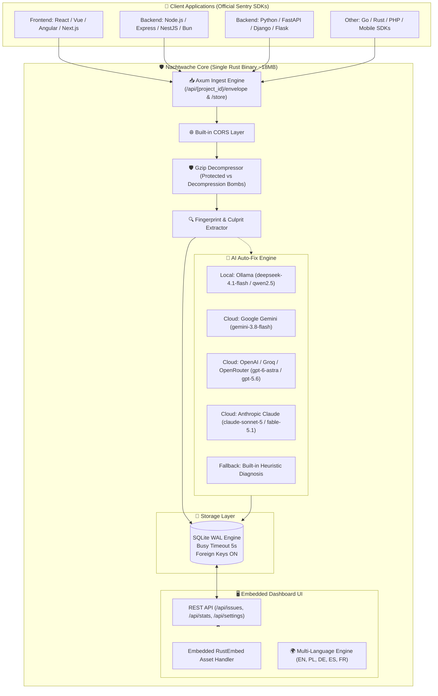

# 🛡️ Nachtwache

<p align="center">
  🌐 <strong>Languages:</strong>
  <a href="README.md"><strong>🇬🇧 English</strong></a> •
  <a href="README.pl.md">🇵🇱 Polski</a> •
  <a href="README.de.md">🇩🇪 Deutsch</a> •
  <a href="README.es.md">🇪🇸 Español</a> •
  <a href="README.fr.md">🇫🇷 Français</a>
</p>

<p align="center">
  <strong>Ultra-lightweight, autonomous error tracking and 100% zero-maintenance drop-in Sentry replacement with AI Auto-Fix.</strong><br>
  <em>Single Rust binary, embedded Web UI dashboard, transactional SQLite (WAL), and RAM footprint under 15 MB.</em>
</p>

<p align="center">
  <a href="https://sentry.social-wulf.eu"></a>
  <a href="LICENSE"></a>
  
  
  
  <a href="https://buymeacoffee.com/adrianwulf"></a>
  <a href="https://github.com/sponsors/adrian-wulf"></a>
</p>

<p align="center">
  
  
  
  
  
  
</p>

---

## 📑 Table of Contents
1. [⚡ Why Nachtwache?](#-why-nachtwache)
2. [🌐 Adrian Wulf Ecosystem](#-adrian-wulf-ecosystem)
3. [📊 Comparison: Official Sentry vs Nachtwache](#-comparison-official-sentry-vs-nachtwache)
4. [🏗️ System Architecture](#️-system-architecture)
5. [🚀 Quick Start](#-quick-start)
6. [🔌 Connecting SDKs (Drop-In Sentry)](#-connecting-sdks-drop-in-sentry)
7. [🤖 AI Configuration (Auto-Fix & Git Patch)](#-ai-configuration-auto-fix--git-patch)
8. [🌐 Production Deployment (Coolify & Docker)](#-production-deployment-coolify--docker)
9. [☕ Support the Project (Buy Me a Coffee & GitHub Sponsors) & RobinHood dev](#-support-the-project-buy-me-a-coffee--github-sponsors--robinhood-dev)
10. [⚖️ Impressum & Legal Notice (§ 5 DDG / MIT)](#️-impressum--legal-notice--5-ddg--mit)

---

## ⚡ Why Nachtwache?

Official Sentry is an industry standard, but for small-to-medium teams, freelancers, and independent developers, it presents two major hurdles:
1. **SaaS is expensive with harsh quotas**: A free tier of 5,000 events can evaporate in minutes during a single production error loop. Paid plans escalate rapidly.
2. **Self-hosted is an infrastructure behemoth**: The official Docker Compose stack spins up **over 20 microservices** (Kafka, ClickHouse, PostgreSQL, Redis, Snuba, Celery, Relay, Zookeeper) requiring at least **16–32 GB of RAM**. That means hundreds of dollars per month just for error monitoring!
3. **Licensing traps (BSL/FSL)**: Restrictive licenses curtail commercial flexibility.

**Nachtwache solves this once and for all:**
* **Zero external dependencies**: A single Rust binary bundling an async HTTP engine, embedded SQLite in WAL mode, and full Web UI.
* **100% Drop-In Sentry SDK Compatibility**: Seamlessly works with `@sentry/browser`, `@sentry/node`, `sentry-sdk` (Python), Go, Rust, and mobile SDKs. Just point your DSN to Nachtwache.
* **AI Auto-Fix & Unified Git Diff**: One click triggers an LLM analysis (local Ollama, Gemini, OpenAI, Claude) diagnosing the root cause and generating a ready-to-apply git patch.
* **Ultra-low resource footprint**: Consumes only **~15 MB of RAM** and 0% idle CPU. Runs effortlessly on a $4/month VPS, Raspberry Pi, or Oracle Cloud Free Tier.
* **Privacy & GDPR / DSGVO Compliance**: Telemetry stays on your own server. No telemetry data is transmitted to US corporate silos.

---

## 🌐 Adrian Wulf Ecosystem

Nachtwache is an integral part of an independent suite of developer and business tools built under the **RobinHood dev** philosophy:

| Service / Project | Live URL | Purpose |
| :--- | :---: | :--- |
| 🛡️ **Nachtwache (Cloud)** | [sentry.social-wulf.eu](https://sentry.social-wulf.eu) | **Live Instance:** Crash monitoring, drop-in Sentry alternative, and AI Auto-Fix (~15 MB RAM). |
| 🚀 **Wulf Lead.er** | [lead.social-wulf.eu](https://lead.social-wulf.eu) | **B2B Lead Intelligence & OSINT Auditor:** Local business prospecting, SEO/Core Web Vitals auditing, tech stack detection, and AI outreach pitch generation. |
| 🌐 **Central Wulf Hub** | [social-wulf.eu](https://social-wulf.eu) | **Main Ecosystem Hub:** Portfolio, business tools, and technical documentation portal by Adrian Wulf. |
| 💼 **Wulf Code** | [wulf-code.it](https://wulf-code.it) | **Software House & Consulting:** Custom software engineering, high-performance systems, and security audits. |

---

## 📊 Comparison: Official Sentry vs Nachtwache

| Feature / Metric | Official Sentry (Self-Hosted) | Sentry Cloud (SaaS) | 🛡️ **Nachtwache** (Adrian Wulf) |
| :--- | :---: | :---: | :---: |
| **RAM Footprint** | **16 GB – 32 GB RAM** | N/A (Cloud) | **~15 MB RAM** |
| **Containers count** | **20+ microservices** (Kafka, ClickHouse, Postgres, Redis...) | Closed infra | **1 single binary** or 1 lightweight container |
| **Server Requirements** | Dedicated server (min. 4-8 vCPU) | None (client only) | $4 VPS / Raspberry Pi / Free Tier |
| **Sentry SDK Protocol** | 100% native | 100% native | **100% Drop-In Compatibility** |
| **Database** | PostgreSQL + ClickHouse + Redis | N/A | **Native SQLite (WAL) with auto-vacuum** |
| **AI Auto-Fix & Git Patch** | Not included | Enterprise add-on | **Built-in out of the box** (Ollama, Gemini, OpenAI, Claude) |
| **Setup Time** | 30–60 minutes | Cloud signup | **1 minute** (`cargo run` or `docker compose up`) |
| **Coolify Support** | Complex / Not recommended | N/A (SaaS) | **Native 1-Click Deploy** with persistent volume |
| **Privacy & GDPR** | Self-hosted, complex ops | Data shared with 3rd parties | **100% On-Premise**, zero tracking |
| **License Cost** | FSL / BSL (commercial limits) | $26 to $500+/mo | **100% Free MIT License** |

---

## 🏗️ System Architecture

Nachtwache is built following the principles of minimalism, speed, and reliability:



---

## 🚀 Quick Start

### Option 1: Docker Compose (Recommended)

Clone the repository and launch the container:

```bash
git clone https://github.com/adrian-wulf/nachtwache.git
cd nachtwache
docker compose up -d
```

Open your browser:
* Dashboard UI: `http://localhost:8080`
* Ingestion DSN: `http://public@localhost:8080/1`

### Option 2: Native Cargo Run

Prerequisites: Rust 1.85+ installed:

```bash
git clone https://github.com/adrian-wulf/nachtwache.git
cd nachtwache
cargo run --release
```

---

## 🔌 Connecting SDKs (Drop-In Sentry)

Nachtwache requires zero custom SDK code. Simply configure standard Sentry SDKs with your Nachtwache DSN endpoint.

### 1. JavaScript / TypeScript (React, Vue, Next.js, Browser)
```typescript
import * as Sentry from "@sentry/browser";

Sentry.init({
  dsn: "http://public@localhost:8080/1", // or https://sentry.your-domain.com/1
  tracesSampleRate: 1.0,
});
```

### 2. Node.js / Express / NestJS
```typescript
import * as Sentry from "@sentry/node";

Sentry.init({
  dsn: "http://public@localhost:8080/1",
});
```

### 3. Python (FastAPI, Django, Flask)
```python
import sentry_sdk

sentry_sdk.init(
    dsn="http://public@localhost:8080/1",
    traces_sample_rate=1.0,
)
```

---

## 🤖 AI Configuration (Auto-Fix & Git Patch)

Navigate to the **AI Config** tab in the dashboard. Nachtwache supports:

1. **Ollama (Default & 100% Free / Local)**:
   * Endpoint: `http://localhost:11434` (or `http://host.docker.internal:11434` inside Docker)
   * Recommended model: `deepseek-4.1-flash` or `deepseek-v3`
2. **Google Gemini**:
   * Model: `gemini-3.8-flash`
   * API Key: Get from [Google AI Studio](https://aistudio.google.com/)
3. **OpenAI / Groq / DeepSeek / OpenRouter**:
   * Endpoint: `https://api.openai.com` (or compatible endpoint)
   * Model: `gpt-6-astra`, `gpt-5.6-sol`, or `deepseek-chat`
4. **Anthropic Claude**:
   * Model: `claude-sonnet-5` or `claude-fable-5-1`

---

## 🌐 Production Deployment (Coolify & Docker)

Deploy in Coolify in seconds:
1. Create a new service from Git repository: `https://github.com/adrian-wulf/nachtwache.git`.
2. Port: `8080`.
3. Persistent Storage Volume: Mount `/data` to preserve the SQLite database.

### Reverse Proxy Configuration (Caddy with automatic HTTPS)
```caddy
sentry.your-domain.com {
    reverse_proxy 127.0.0.1:8080
}
```

---

## ☕ Support the Project (Buy Me a Coffee & GitHub Sponsors) & RobinHood dev

<p align="center">
  <a href="https://buymeacoffee.com/adrianwulf"></a>
  <a href="https://github.com/sponsors/adrian-wulf"></a>
</p>

### What is the RobinHood dev philosophy?
> **"Production stability, high-performance tooling, and modern developer infrastructure should be accessible to every engineer, not a luxury locked behind enterprise cloud pricing."**

Modern monitoring platforms often lock developers into predatory subscriptions:
* Raising bills precisely when an application suffers an outage and produces error spikes.
* Mandating massive microservice clusters that require full-time DevOps engineers.

**Nachtwache was built in the spirit of RobinHood dev:**
* Empowering developers, freelancers, startups, and small teams with autonomous, zero-maintenance error tracking and code diagnostics for $0.
* 100% Open Source with zero telemetry, zero paywalls, and zero feature gates.

### How can you help?
* ☕ **Buy Me a Coffee:** [buymeacoffee.com/adrianwulf](https://buymeacoffee.com/adrianwulf)
* 💖 **Support via GitHub Sponsors:** [github.com/sponsors/adrian-wulf](https://github.com/sponsors/adrian-wulf)
* ⭐ **Star the repository on GitHub:** Help the project reach more engineers worldwide.
* 🛠️ **Submit Pull Requests & Issues:** Share your ideas and enhancements.

---

## ⚖️ Impressum & Legal Notice (§ 5 DDG / MIT)

### Information pursuant to § 5 German Digital Services Act (DDG):
* **Developer / Publisher:** Adrian Wulf
* **Contact:** Available via GitHub: [https://github.com/adrian-wulf](https://github.com/adrian-wulf) and portal [https://social-wulf.eu](https://social-wulf.eu) / [https://wulf-code.it](https://wulf-code.it).

### Disclaimer & MIT License:
Software is provided "AS IS", without warranty of any kind, express or implied, including but not limited to warranties of merchantability or fitness for a particular purpose. See [LICENSE](LICENSE) for full details.

### Trademark Notice:
**Sentry** and the Sentry logo are registered trademarks of **Functional Software, Inc.**  
**Nachtwache** is an independent open-source project implementing the open Sentry event ingest protocol. It is not affiliated with, endorsed by, or sponsored by Functional Software, Inc.

---

<p align="center">
  <em>Crafted with passion for the Open Source community by Adrian Wulf.</em>
</p>
