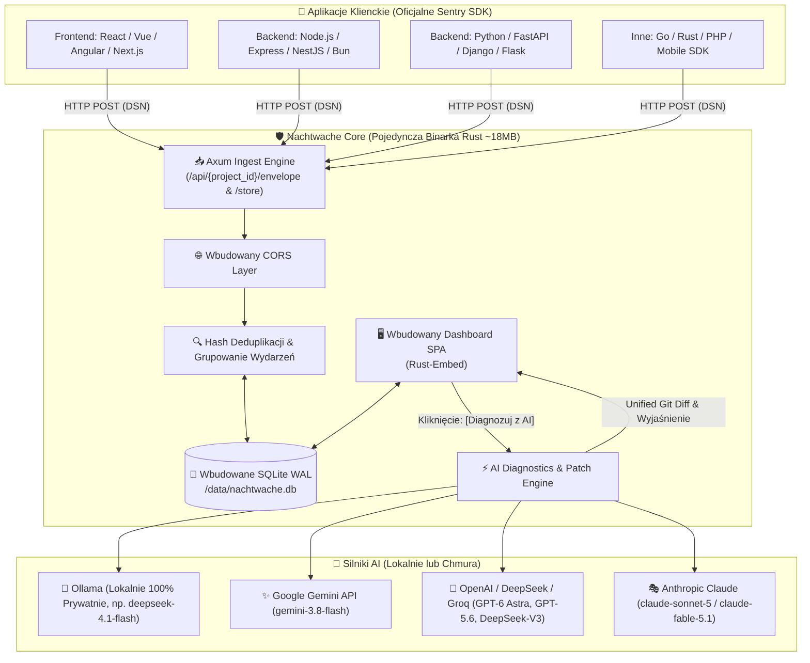

# 🛡️ Nachtwache

<p align="center">
  🌐 <strong>Języki / Languages:</strong>
  <a href="README.md">🇬🇧 English</a> •
  <a href="README.pl.md"><strong>🇵🇱 Polski</strong></a> •
  <a href="README.de.md">🇩🇪 Deutsch</a> •
  <a href="README.es.md">🇪🇸 Español</a> •
  <a href="README.fr.md">🇫🇷 Français</a>
</p>

<p align="center">
  <strong>Ultra-lekki, autonomiczny strażnik błędów i w 100% bezobsługowy drop-in zamiennik Sentry ze wsparciem AI Auto-Fix.</strong><br>
  <em>Pojedyncza binarka w Rust, wbudowany dashboard Web UI, baza SQLite (WAL) i zużycie pamięci poniżej 15 MB RAM.</em>
</p>

<p align="center">
  <a href="https://sentry.social-wulf.eu"></a>
  <a href="LICENSE"></a>
  
  
  
  <a href="https://buymeacoffee.com/adrianwulf"></a>
  <a href="https://github.com/sponsors/adrian-wulf"></a>
</p>

<p align="center">
  
  
  
  
  
  
</p>

---

## 📑 Spis Treści
1. [⚡ Dlaczego Nachtwache?](#-dlaczego-nachtwache)
2. [🌐 Ekosystem Adriana Wulfa](#-ekosystem-adriana-wulfa)
3. [📊 Porównanie: Oficjalne Sentry vs Nachtwache](#-porównanie-oficjalne-sentry-vs-nachtwache)
4. [🏗️ Architektura Systemu](#️-architektura-systemu)
5. [🚀 Szybki Start](#-szybki-start)
6. [🔌 Podłączenie Aplikacji (Drop-In Sentry)](#-podłączenie-aplikacji-drop-in-sentry)
7. [🤖 Konfiguracja AI (Auto-Fix & Git Patch)](#-konfiguracja-ai-auto-fix--git-patch)
8. [🌐 Wdrożenie Produkcyjne (Coolify & Docker)](#-wdrożenie-produkcyjne-coolify--docker)
9. [☕ Wesprzyj projekt (Buy Me a Coffee) & Filozofia RobinHood dev](#-wesprzyj-projekt-buy-me-a-coffee--filozofia-robinhood-dev)
10. [⚖️ Impressum & Nota Prawna (§ 5 DDG / MIT)](#️-impressum--nota-prawna--5-ddg--mit)

---

## ⚡ Dlaczego Nachtwache?

Oficjalne Sentry to uznany standard w branży, jednak w realiach małych i średnich projektów rodzi dwa potężne problemy:
1. **SaaS jest kosztowny i ma restrykcyjne limity**: darmowy próg 5 000 zdarzeń potrafi wyparować w kilkanaście minut podczas jednej pętli błędu na produkcji. Płatne pakiety rosną skokowo.
2. **Self-hosted to potężny moloch**: oficjalny stos Docker Compose wymaga ponad **20 mikroserwisów** (Kafka, ClickHouse, PostgreSQL, Redis, Snuba, Celery, Relay, Zookeeper) oraz minimum **16–32 GB pamięci RAM**. To setki euro miesięcznie za sam serwer monitoringu!
3. **Restrykcje licencyjne (BSL/FSL)**: licencje ograniczają swobodę biznesową.

**Nachtwache rozwiązuje to definitywnie:**
* **Zero zależności zewnętrznych**: Pojedyncza binarka w języku Rust kompilująca w sobie silnik HTTP, wbudowaną bazę SQLite z trybem WAL oraz pełny frontend Web UI.
* **100% Drop-In Sentry SDK**: Współpracuje z oficjalnymi bibliotekami `@sentry/browser`, `@sentry/node`, `sentry-sdk` (Python) i dowolnymi innymi. Zmieniasz tylko adres DSN w konfiguracji aplikacji.
* **AI Auto-Fix & Unified Git Diff**: Jedno kliknięcie uruchamia analizę LLM (lokalna Ollama, Gemini, OpenAI, Claude), która interpretuje stack trace, ostatnie breadcrumbs i generuje gotowy diff kodu źródłowego naprawiający przyczynę błędu.
* **Ultra-niskie zużycie zasobów**: Zużywa jedynie **~15 MB RAM-u** i 0% CPU w stanie spoczynku. Działa perfekcyjnie na najtańszym VPS za 4 EUR, instancji Raspberry Pi czy bezpłatnym Oracle Cloud Free Tier.
* **Prywatność & RODO / DSGVO**: Dane o awariach nie wędrują do zewnętrznych chmur ani korporacyjnych silosów w USA.

---

## 🌐 Ekosystem Adriana Wulfa

Nachtwache jest integralną częścią rodziny niezależnych, wydajnych narzędzi tworzonych w duchu **RobinHood dev** — bez abonamentów i korporacyjnego narzutu:

| Usługa / Projekt | Adres URL | Przeznaczenie |
| :--- | :---: | :--- |
| 🛡️ **Nachtwache (Chmura)** | [sentry.social-wulf.eu](https://sentry.social-wulf.eu) | **Instancja Live:** Monitorowanie błędów, drop-in zamiennik Sentry i AI Auto-Fix (~15 MB RAM). |
| 🚀 **Wulf Lead.er** | [lead.social-wulf.eu](https://lead.social-wulf.eu) | **Generator Leadów B2B & Audytor OSINT:** Pozyskiwanie klientów, audyty SEO/Core Web Vitals, wykrywanie technologii i AI pitch generator. |
| 🌐 **Centralny Wulf Hub** | [social-wulf.eu](https://social-wulf.eu) | **Główny Hub Ekosystemu:** Wizytówka projektów, narzędzia biznesowe i centrum serwisowe Adriana Wulfa. |
| 💼 **Wulf Code** | [wulf-code.it](https://wulf-code.it) | **Software House & Consulting:** Dedykowane wdrożenia, audyty bezpieczeństwa i tworzenie oprogramowania na zamówienie. |

---

## 📊 Porównanie: Oficjalne Sentry vs Nachtwache

| Cecha / Parametr | Oficjalne Sentry (Self-Hosted) | Sentry Cloud (SaaS) | 🛡️ **Nachtwache** (Adrian Wulf) |
| :--- | :---: | :---: | :---: |
| **Zużycie RAM** | **16 GB – 32 GB RAM** | N/A (chmura) | **~15 MB RAM** |
| **Liczba kontenerów** | **20+ kontenerów** (Kafka, ClickHouse, Postgres, Redis...) | Zamknięta infrastruktura | **1 pojedyncza binarka** lub 1 lekki kontener |
| **Wymagania serwera** | Dedykowany serwer (min. 4-8 vCPU) | Brak po stronie klienta | Tani VPS za 4€ / Raspberry Pi / Free Tier |
| **Protokół Sentry SDK** | 100% natywny | 100% natywny | **100% Drop-In Compatibility** |
| **Baza danych** | PostgreSQL + ClickHouse + Redis | N/A | **Natywna SQLite (WAL) z auto-vacuum** |
| **AI Auto-Fix & Git Patch** | Brak w standardzie | Płatne plany Enterprise | **Wbudowane w standardzie** (Ollama, Gemini, OpenAI, Claude) |
| **Czas instalacji** | 30–60 minut (często awaryjna konfiguracja) | Rejestracja w chmurze | **1 minuta** (`cargo run` lub `docker compose up`) |
| **Wsparcie Coolify** | Bardzo trudne / niezalecane | Brak (to zewnętrzny SaaS) | **Natywne 1-Click Deploy** z persistent volume |
| **Prywatność i RODO** | Własny serwer, ale złożone zarządzanie | Dane przesyłane do podmiotów trzecich | **100% On-Premise**, zero telemetrii |
| **Koszt licencji** | FSL / BSL (restrykcje komercyjne) | Od 26$ do setek $/miesiąc | **100% Wolna Licencja MIT** |

---

## 🏗️ Architektura Systemu

Nachtwache została zaprojektowana według reguły minimalizmu i niezawodności. Zamiast rozproszonej kolejki Kafka i klastra analitycznego, zastosowano asynchroniczny runtime **Tokio** w połączeniu z transakcyjną bazą **SQLite w trybie WAL**.



### Schemat ASCII (dla terminala):
```
+--------------------------------------------------------------------------+
|                  APLIKACJE KLIENTA (Standardowe Sentry SDK)              |
|   React / Next.js    *    Node.js / Express    *    Python FastAPI/Django|
+--------------------------------------------------------------------------+
                                    |
                 HTTP POST (DSN: http://...@serwer:8080/1)
                                    v
+--------------------------------------------------------------------------+
|                 🛡️ NACHTWACHE (Pojedynczy proces Rust)                    |
|                                                                          |
|   [ Ingest HTTP API ] ----> [ Agregacja & Hash ] ----> [ SQLite (WAL) ]  |
|   • /envelope                                                |           |
|   • /store                                                   v           |
|                                                     [ Dashboard Web UI ] |
|                                                              |           |
|                                                 [ AI Diagnostics Core ]  |
+--------------------------------------------------------------|-----------+
                                                               |
            +--------------------+-------------------+---------+
            |                    |                   |         |
            v                    v                   v         v
     [ Ollama Local ]       [ Google Gemini ]     [ OpenAI ]  [ Claude ]
(deepseek-4.1-flash)        (gemini-3.8-flash)  (GPT-6 Astra) (Sonnet 5)
```

---

## 🚀 Szybki Start

### Opcja 1: Uruchomienie przez Docker (1 komenda)
```bash
docker run -d \
  --name nachtwache \
  -p 8080:8080 \
  -v $(pwd)/data:/data \
  --restart unless-stopped \
  ghcr.io/adrian-wulf/nachtwache:latest
```

### Opcja 2: Docker Compose
Sklonuj repozytorium i uruchom gotowy stos:
```bash
git clone https://github.com/adrian-wulf/nachtwache.git
cd nachtwache
docker compose up -d
```

### Opcja 3: Kompilacja ze źródeł (Rust / Cargo)
```bash
git clone https://github.com/adrian-wulf/nachtwache.git
cd nachtwache
cargo build --release

# Uruchomienie binarki:
./target/release/nachtwache
```

Otwórz w przeglądarce: **`http://localhost:8080`**  
Twój uniwersalny adres DSN do wklejenia w aplikacjach:
```
http://public@localhost:8080/1
```
*(Gdy wdrożysz serwer na domenie z SSL, podmień adres na np. `https://public@sentry.twoja-domena.pl/1`)*.

---

## 🔌 Podłączenie Aplikacji (Drop-In Sentry)

Nie musisz instalować żadnych dedykowanych bibliotek — używasz oficjalnego, sprawdzonego ekosystemu Sentry.

### 1. JavaScript / TypeScript / React / Next.js / Vue
```bash
npm install @sentry/browser
# lub: pnpm add @sentry/browser
```
```typescript
import * as Sentry from "@sentry/browser";

Sentry.init({
  dsn: "http://public@localhost:8080/1", // Podmień na adres swojej instancji Nachtwache
  tracesSampleRate: 1.0,
});
```

### 2. Node.js / Express / NestJS / Bun
```bash
npm install @sentry/node
```
```typescript
import * as Sentry from "@sentry/node";

Sentry.init({
  dsn: "http://public@localhost:8080/1",
  tracesSampleRate: 1.0,
});
```

### 3. Python / FastAPI / Django / Flask
```bash
pip install sentry-sdk
```
```python
import sentry_sdk

sentry_sdk.init(
    dsn="http://public@localhost:8080/1",
    traces_sample_rate=1.0,
)
```

---

## 🤖 Konfiguracja AI (Auto-Fix & Git Patch)

Nachtwache posiada wbudowanego asystenta analizy przyczyn źródłowych (Root Cause Analysis). Kliknięcie przycisku **`[ ⚡ Diagnozuj z AI ]`** przy dowolnym błędzie analizuje stos wywołań (*stack trace*), punkty kontrolne użytkownika (*breadcrumbs*) oraz kod aplikacji, generując natychmiastowy opis problemu oraz gotową łatkę **Git Diff / Patch**.

Konfigurację wykonujesz bezpośrednio w Dashboardzie (zakładka **Ustawienia AI**) lub przez API:

### 1. 🦙 Ollama (Lokalnie, 100% Prywatności)
* **Provider:** `ollama`
* **Endpoint:** `http://localhost:11434` (lub `http://host.docker.internal:11434` w Dockerze)
* **Model:** `deepseek-4.1-flash`, `deepseek-v3`
* **Zaleta:** Żadne dane o błędach nie opuszczają Twojej maszyny.

### 2. ✨ Google Gemini
* **Provider:** `gemini`
* **API Key:** Twój klucz z [Google AI Studio](https://aistudio.google.com/)
* **Model:** `gemini-3.8-flash`
* **Zaleta:** Błyskawiczne odpowiedzi i obszerny darmowy limit zapytań.

### 3. 🧠 OpenAI / DeepSeek / Groq / OpenRouter
* **Provider:** `openai` (lub `deepseek` / `groq`)
* **Endpoint:** `https://api.openai.com/v1` (lub endpoint DeepSeek / Groq)
* **API Key:** Twój klucz API
* **Model:** `gpt-6-astra`, `gpt-5.6-sol`, `deepseek-v3`

### 4. 🎭 Anthropic Claude
* **Provider:** `anthropic`
* **API Key:** Twój klucz z Anthropic Console
* **Model:** `claude-sonnet-5` lub `claude-fable-5-1`

*(W przypadku braku skonfigurowanego klucza zewnętrznego, Nachtwache korzysta z wbudowanego, deterministycznego silnika heurystycznego)*.

---

## 🌐 Wdrożenie Produkcyjne (Coolify & Docker)

### Wdrożenie na Coolify (Rekomendowane)
Coolify to nowoczesny, open-source'owy odpowiednik Heroku/Netlify. Nachtwache działa na nim bezbłędnie:

1. W panelu Coolify przejdź do swojego projektu i kliknij **+ Add New Resource** -> **Application**.
2. Wybierz **Public Repository** i wklej URL:
   ```
   https://github.com/adrian-wulf/nachtwache.git
   ```
3. Wybierz metodę budowania: **Dockerfile**.
4. W zakładce **Configuration**:
   * **Port:** Ustaw na `8080`.
   * **Persistent Storage:** Dodaj montowanie wolumenu dla bazy danych:
     * Source: `nachtwache_data` (lub wolumen nazwany)
     * Destination: `/data`
5. Przypisz domenę (np. `sentry.twoja-domena.pl`). Coolify automatycznie wygeneruje certyfikat SSL z Let's Encrypt.
6. Kliknij **Deploy**. Gotowe!

---

### Wdrożenie przez Docker Compose na VPS
Stwórz plik `docker-compose.yml`:
```yaml
services:
  nachtwache:
    image: ghcr.io/adrian-wulf/nachtwache:latest
    # Lub budowanie lokalne:
    # build: .
    container_name: nachtwache
    restart: unless-stopped
    ports:
      - "127.0.0.1:8080:8080"
    environment:
      - PORT=8080
      - HOST=0.0.0.0
      - NACHTWACHE_DB=/data/nachtwache.db
    volumes:
      - ./data:/data
```
Uruchomienie:
```bash
docker compose up -d
```

### Konfiguracja Reverse Proxy (Caddy) z automatycznym SSL
```caddy
sentry.twoja-domena.pl {
    reverse_proxy 127.0.0.1:8080
}
```

---

## ☕ Wesprzyj projekt (Buy Me a Coffee & GitHub Sponsors) & Filozofia RobinHood dev

<p align="center">
  <a href="https://buymeacoffee.com/adrianwulf"></a>
  <a href="https://github.com/sponsors/adrian-wulf"></a>
</p>

### Czym jest filozofia RobinHood dev?
> **„Nowoczesne narzędzia inżynierskie, stabilność produkcji i swoboda wdrażania oprogramowania nie powinny być luksusem zarezerwowanym wyłącznie dla korporacji z gigantycznymi budżetami.”**

Większość współczesnych narzędzi monitorowania produkcji stała się pułapkami subskrypcyjnymi:
* Odcinają dostęp lub drastycznie podnoszą rachunki w momencie, gdy aplikacja ma najwięcej problemów i generuje błędy.
* Narzucają skomplikowaną infrastrukturę mikroserwisów, której utrzymanie wymaga dedykowanego inżyniera DevOps.

Projekt **Nachtwache** powstał w duchu **RobinHood dev**:
* Zwracamy kontrolę w ręce programistów i dajemy każdemu inżynierowi, freelancerowi, startupowi i zespołowi pełną suwerenność: **lekkie, autonomiczne wykrywanie awarii, lokalną diagnostykę i automatyczne łatki kodu za 0 zł**.
* Projekt jest w 100% otwartoźródłowy, nie posiada ukrytych paywalli, płatnych funkcji „pro” ani telemetrii śledzącej użytkowników.

### Jak możesz pomóc?
Jeśli Nachtwache oszczędza Twoje serwery, redukuje rachunki za chmurę lub pomogła Ci szybko naprawić błąd o 3:00 w nocy — dołóż cegiełkę do jej rozwoju:
* ☕ **Postaw wirtualną kawę:** [buymeacoffee.com/adrianwulf](https://buymeacoffee.com/adrianwulf)
* 💖 **Wspieraj na GitHub Sponsors:** [github.com/sponsors/adrian-wulf](https://github.com/sponsors/adrian-wulf)
* ⭐ **Zostaw gwiazdkę na GitHubie:** Pomóż projektowi dotrzeć do kolejnych deweloperów.
* 🛠️ **Twórz Pull Requesty:** Zgłaszaj pomysły i ulepszenia w sekcji Issues.

---

## ⚖️ Impressum & Nota Prawna (§ 5 DDG / MIT)

### Informacje zgodnie z § 5 niemieckiej ustawy o usługach cyfrowych (DDG - Digitale-Dienste-Gesetz):
Projekt jest rozwijany i publikowany przez:
* **Autor / Usługodawca:** Adrian Wulf
* **Kontakt:** Dostępny za pośrednictwem profilu GitHub: [https://github.com/adrian-wulf](https://github.com/adrian-wulf) oraz platformy [https://social-wulf.eu](https://social-wulf.eu) / [https://wulf-code.it](https://wulf-code.it).

### Wyłączenie odpowiedzialności (Disclaimer) & Licencja MIT:
Oprogramowanie jest dostarczane w stanie, w jakim się znajduje (**„AS IS”**), bez jakichkolwiek gwarancji, wyraźnych lub dorozumianych, w tym m.in. gwarancji przydatności handlowej lub przydatności do określonego celu. Pełna treść licencji dostępna jest w pliku [LICENSE](LICENSE).

### Znak towarowy (Trademark Notice):
Nazwa **Sentry** oraz logo Sentry są zarejestrowanymi znakami towarowymi należącymi do **Functional Software, Inc.**  
Projekt **Nachtwache** jest niezależnym oprogramowaniem typu Open Source implementującym otwarty protokół raportowania zdarzeń Sentry. Projekt nie jest w żaden sposób powiązany, autoryzowany ani sponsorowany przez Functional Software, Inc.

---

<p align="center">
  <em>Stworzone z pasją dla społeczności Open Source przez Adriana Wulfa.</em>
</p>
